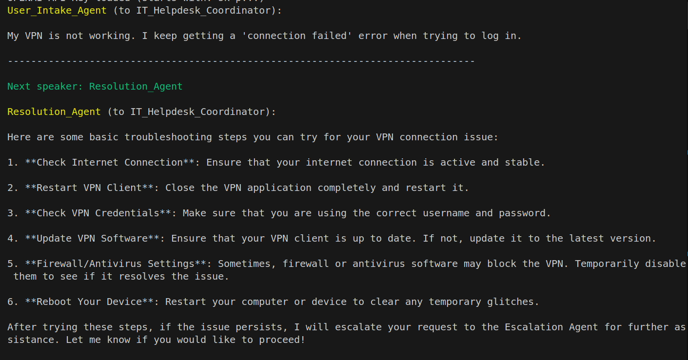

# AI Help Desk - Multi-Agent System Prototype

## 1. Overview

This project is a prototype multi-agent AI system designed to simulate an IT Help Desk, built using the Microsoft AutoGen framework. It demonstrates agent collaboration, basic memory retention, and task execution (resolution/escalation) for handling employee IT issues as per the specified task requirements.

## 2. Architecture

The system employs a group chat architecture managed by a central coordinator.

*   **Agents:**
    *   **User Intake Agent:** Receives and processes the initial request.
    *   **Resolution Agent:** Attempts resolution using simulated knowledge base lookups and function calls (e.g., password reset). Escalates if unable to resolve.
    *   **Escalation Agent:** Handles escalated issues, generates a summary, simulates creating a support ticket via a function call (`notify_support_team`), and terminates the process.
    *   **Master Agent (Coordinator):** (`GroupChatManager`) Oversees agent interactions and selects the next speaker.
    *   **User Proxy Agent (Internal):** (`UserProxyAgent`) Initiates the chat internally and simulates basic user replies within the agent flow.
*   **Communication:** Agents communicate indirectly via the `GroupChatManager`, which routes messages based on the conversation flow.
*   **Memory:** The `GroupChatManager` maintains the conversation history for the current session, providing context and enabling resolution tracking within that session.

### Diagram


### Response Chat Example



### How the Communication happens between Agents
- First User query pass into User Intake Agent Receives employee requests (e.g., 'I can't access my email'). Extracts key details and assigns the request to the resolution agent.

- After assigning the appropriate agent the agent try solve the query of employee for example: In our case Resolution Agent based upon the user query it will check into the knowledge base then give response
Attempts to resolve common issues using a predefined knowledge base and function calls
(e.g., resetting a password). 

- If the issue is too complex, it escalates the request.Generates a structured summary for
IT support and triggers a notification.

- All agent communicate via Group chat and Master Agnet keep on eye on all agents.

### How to Run this 
```
Replace your OPENAI_API_KEY in .env file

```

